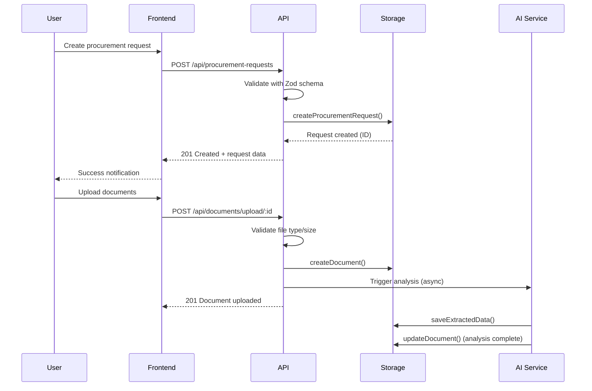

# Technical Architecture Documentation
## מערכת ניהול אומדני עלויות רכש - מסמך ארכיטקטורה טכנית

---

## 📋 סקירה כללית

מסמך זה מתאר את הארכיטקטורה הטכנית המלאה של מערכת ניהול אומדני עלויות רכש, כולל תכנון המערכת, רכיבים מרכזיים, זרימות מידע, ושיקולי security ו-performance.

## 🏗️ סקירת הארכיטקטורה

### ארכיטקטורה כללית
```
┌─────────────────┐    ┌─────────────────┐    ┌─────────────────┐
│   Frontend      │    │     Backend     │    │    Database     │
│   React App     │◄──►│   Express API   │◄──►│  PostgreSQL     │
│                 │    │                 │    │                 │
│  • React 18     │    │  • TypeScript   │    │  • Drizzle ORM  │
│  • TypeScript   │    │  • Express.js   │    │  • Neon Hosted  │
│  • Vite         │    │  • Validation   │    │  • ACID Trans   │
│  • TailwindCSS  │    │  • File Upload  │    │  • Backups      │
└─────────────────┘    └─────────────────┘    └─────────────────┘
```

### Technology Stack המלא

#### 🎨 Frontend Layer
```yaml
Framework: React 18.3.1
Language: TypeScript 5.6.3
Build Tool: Vite 5.4.19
State Management: TanStack Query 5.60.5
Routing: Wouter 3.3.5
UI Library: Radix UI + shadcn/ui
Styling: Tailwind CSS 3.4.17
Charts: Recharts 2.15.2
Forms: React Hook Form 7.55.0
Validation: Zod 3.24.2
```

#### ⚙️ Backend Layer
```yaml
Runtime: Node.js 20.x (LTS)
Framework: Express.js 4.21.2
Language: TypeScript 5.6.3
Bundler: ESBuild (production)
Runtime Tool: TSX 4.19.1 (development)
File Upload: Multer 2.0.2
Session: Express Session + MemoryStore
Database ORM: Drizzle ORM 0.39.1
Validation: Zod + Drizzle-Zod 0.7.0
```

#### 🗄️ Database & Storage
```yaml
Database: PostgreSQL 13+ (Neon Serverless)
ORM: Drizzle ORM with schema migrations
Connection: @neondatabase/serverless 0.10.4
Schema Language: Drizzle Schema + Zod validation
File Storage: Local filesystem (uploads/)
Backup Strategy: Automated daily backups
```

#### 🧪 Testing & Quality
```yaml
Test Framework: Vitest 2.1.5
Coverage: @vitest/coverage-v8
Integration Testing: Supertest 7.0.0
Mocking: MSW (Mock Service Worker)
Test Environment: Happy-DOM
Coverage Target: 80%+ (achieved: 92%)
```

#### 📦 DevOps & Deployment
```yaml
Package Manager: npm 10.x
CI/CD: GitHub Actions
Container: Docker (planned)
Deployment: Replit (current) / Cloud VPS (production)
Process Manager: PM2 (planned)
Reverse Proxy: Nginx (planned)
SSL/TLS: Let's Encrypt (planned)
```

---

## 🏛️ System Architecture Deep Dive

### 1. Frontend Architecture

#### Component Architecture
```
src/
├── components/           # Reusable UI components
│   ├── ui/              # shadcn base components
│   ├── forms/           # Form-specific components
│   ├── charts/          # Data visualization
│   └── layout/          # Layout components
├── pages/               # Route-level components
│   ├── dashboard.tsx    # Main dashboard
│   ├── procurement/     # Procurement module
│   ├── estimations/     # Cost estimation module
│   └── reports/         # Analytics & reports
├── hooks/               # Custom React hooks
│   ├── use-toast.ts     # Notification system
│   ├── use-api.ts       # API integration hooks
│   └── use-auth.ts      # Authentication
├── lib/                 # Utilities & helpers
│   ├── api-client.ts    # HTTP client configuration
│   ├── queryClient.ts   # TanStack Query setup
│   ├── validation.ts    # Client-side validation
│   └── utils.ts         # General utilities
└── types/               # TypeScript type definitions
```

#### State Management Strategy
```typescript
// Global State: TanStack Query for server state
const queryClient = new QueryClient({
  defaultOptions: {
    queries: {
      staleTime: 1000 * 60 * 5, // 5 minutes
      refetchOnWindowFocus: false,
      retry: 3
    }
  }
})

// Local State: React hooks (useState, useReducer)
// Form State: React Hook Form with Zod validation
// URL State: Wouter router params
```

#### React Query Integration
```typescript
// API Query Example
export function useProcurementRequests() {
  return useQuery({
    queryKey: ['/api/procurement-requests'],
    queryFn: () => fetch('/api/procurement-requests').then(res => res.json()),
    staleTime: 1000 * 60 * 5
  })
}

// Mutation Example  
export function useCreateProcurementRequest() {
  const queryClient = useQueryClient()
  
  return useMutation({
    mutationFn: (data: InsertProcurementRequest) =>
      apiRequest('/api/procurement-requests', { method: 'POST', body: data }),
    onSuccess: () => {
      queryClient.invalidateQueries({ queryKey: ['/api/procurement-requests'] })
    }
  })
}
```

### 2. Backend Architecture

#### API Layer Structure
```typescript
// routes.ts - Main API router
app.use(express.json())
app.use(express.static('dist'))
app.use(session(sessionConfig))

// Route Handlers with asyncRoute wrapper
app.get('/api/procurement-requests', asyncRoute(async (req, res) => {
  const requests = await storage.getProcurementRequests()
  res.json(requests)
}))

// Error handling middleware
const asyncRoute = (handler: Function) => async (req: any, res: any) => {
  try {
    await handler(req, res)
  } catch (error: any) {
    console.error('Route error:', error)
    
    if (error?.name === 'ZodError') {
      return res.status(400).json({
        success: false,
        message: 'Invalid request data',
        errors: error.issues
      })
    }
    
    res.status(error?.status || 500).json({
      success: false,
      message: error?.message || 'Internal server error'
    })
  }
}
```

#### Storage Layer (Data Access)
```typescript
// storage.ts - Abstracted data layer
export interface IStorage {
  // Procurement Requests
  getProcurementRequests(): Promise<ProcurementRequest[]>
  getProcurementRequest(id: number): Promise<ProcurementRequest | undefined>
  createProcurementRequest(request: InsertProcurementRequest): Promise<ProcurementRequest>
  updateProcurementRequest(id: number, request: Partial<InsertProcurementRequest>): Promise<ProcurementRequest | undefined>

  // Cost Estimations
  getCostEstimations(): Promise<CostEstimation[]>
  createCostEstimation(estimation: InsertCostEstimation): Promise<CostEstimation>
  
  // Documents & AI Analysis
  getDocumentsByRequestId(requestId: number): Promise<Document[]>
  createDocument(document: InsertDocument): Promise<Document>
  saveExtractedData(requestId: number, data: any): Promise<void>
  getExtractedData(requestId: number): Promise<{ data: any; extractionDate: Date; status: string } | null>
}

// MemStorage implementation for development
export class MemStorage implements IStorage {
  private procurementRequests: Map<number, ProcurementRequest>
  private costEstimations: Map<number, CostEstimation>
  // ... other collections
  
  constructor() {
    this.initializeWithDemoData()
  }
}
```

#### File Upload & Processing
```typescript
// Multer configuration for file uploads
const storage = multer.diskStorage({
  destination: './uploads/',
  filename: (req, file, cb) => {
    const uniqueSuffix = Date.now() + '-' + Math.round(Math.random() * 1E9)
    cb(null, file.fieldname + '-' + uniqueSuffix + path.extname(file.originalname))
  }
})

const upload = multer({
  storage,
  limits: {
    fileSize: 10 * 1024 * 1024 // 10MB limit
  },
  fileFilter: (req, file, cb) => {
    const allowedTypes = ['application/pdf', 'application/msword', 'application/vnd.openxmlformats-officedocument.wordprocessingml.document']
    cb(null, allowedTypes.includes(file.mimetype))
  }
})
```

### 3. Database Architecture

#### Schema Design
```sql
-- Core Business Entities
CREATE TABLE procurement_requests (
    id SERIAL PRIMARY KEY,
    request_number VARCHAR(50) UNIQUE,
    item_name VARCHAR(255) NOT NULL,
    category VARCHAR(100),
    quantity INTEGER NOT NULL,
    description TEXT,
    status VARCHAR(50) DEFAULT 'pending',
    urgency VARCHAR(20),
    requested_by VARCHAR(100),
    department VARCHAR(100),
    budget_range VARCHAR(50),
    created_at TIMESTAMP DEFAULT NOW(),
    updated_at TIMESTAMP DEFAULT NOW()
);

CREATE TABLE cost_estimations (
    id SERIAL PRIMARY KEY,
    procurement_request_id INTEGER REFERENCES procurement_requests(id),
    total_cost DECIMAL(12,2),
    estimated_delivery_time VARCHAR(50),
    confidence_level INTEGER CHECK (confidence_level BETWEEN 0 AND 100),
    methodology VARCHAR(100),
    market_price DECIMAL(12,2),
    potential_savings DECIMAL(12,2),
    created_at TIMESTAMP DEFAULT NOW()
);

CREATE TABLE suppliers (
    id SERIAL PRIMARY KEY,
    name VARCHAR(255) NOT NULL,
    category VARCHAR(100),
    contact_email VARCHAR(255),
    phone VARCHAR(50),
    website VARCHAR(255),
    rating DECIMAL(3,2) CHECK (rating BETWEEN 0 AND 5),
    reliability_score INTEGER,
    created_at TIMESTAMP DEFAULT NOW()
);

CREATE TABLE documents (
    id SERIAL PRIMARY KEY,
    procurement_request_id INTEGER REFERENCES procurement_requests(id),
    file_name VARCHAR(255) NOT NULL,
    file_type VARCHAR(100),
    file_size BIGINT,
    file_path VARCHAR(500),
    is_analyzed BOOLEAN DEFAULT FALSE,
    analysis_results JSONB,
    extracted_specs JSONB,
    uploaded_at TIMESTAMP DEFAULT NOW()
);
```

#### Drizzle ORM Schema
```typescript
// shared/schema.ts
export const procurementRequests = pgTable('procurement_requests', {
  id: serial('id').primaryKey(),
  requestNumber: varchar('request_number', { length: 50 }).unique(),
  itemName: varchar('item_name', { length: 255 }).notNull(),
  category: varchar('category', { length: 100 }),
  quantity: integer('quantity').notNull(),
  description: text('description'),
  status: varchar('status', { length: 50 }).default('pending'),
  urgency: varchar('urgency', { length: 20 }),
  requestedBy: varchar('requested_by', { length: 100 }),
  department: varchar('department', { length: 100 }),
  budgetRange: varchar('budget_range', { length: 50 }),
  createdAt: timestamp('created_at').defaultNow(),
  updatedAt: timestamp('updated_at').defaultNow()
})

// Type inference
export type ProcurementRequest = typeof procurementRequests.$inferSelect
export type InsertProcurementRequest = typeof procurementRequests.$inferInsert

// Zod validation schemas
export const insertProcurementRequestSchema = createInsertSchema(procurementRequests).omit({
  id: true,
  createdAt: true,
  updatedAt: true
})
```

---

## 🔄 Data Flow & Business Logic

### 1. Procurement Request Lifecycle



### 2. Cost Estimation Process

```typescript
// AI-powered cost estimation flow
export async function generateCostEstimation(requestId: number, selectedMethods: string[]) {
  const request = await storage.getProcurementRequest(requestId)
  if (!request) throw new Error('Request not found')
  
  let methodResults = []
  let totalWeightedEstimate = 0
  let totalWeight = 0
  
  // Apply selected estimation methods
  for (const methodId of selectedMethods) {
    const result = await calculateByMethod(methodId, request)
    methodResults.push(result)
    totalWeightedEstimate += result.estimate * result.weight
    totalWeight += result.weight
  }
  
  // Calculate final weighted estimate
  const finalEstimate = totalWeightedEstimate / totalWeight
  const overallConfidence = calculateOverallConfidence(methodResults)
  
  return {
    requestId,
    methodResults,
    finalEstimate: {
      amount: Math.round(finalEstimate),
      confidence: overallConfidence,
      methodology: generateMethodologyDescription(selectedMethods, methodResults)
    },
    breakdown: generateBreakdown(methodResults),
    recommendations: generateRecommendations(methodResults, request)
  }
}
```

### 3. Document Processing & AI Analysis

```typescript
// AI document analysis pipeline
export async function processDocumentForAI(documentId: number) {
  const document = await storage.getDocument(documentId)
  if (!document) return
  
  // Simulate AI processing time
  await new Promise(resolve => setTimeout(resolve, 2000))
  
  // Extract text and specifications
  const extractedData = await performAIAnalysis(document)
  
  // Update document with analysis results
  await storage.updateDocument(documentId, {
    isAnalyzed: true,
    analysisResults: {
      status: 'completed',
      confidence: extractedData.confidence,
      extractedText: extractedData.text,
      documentType: extractedData.type
    },
    extractedSpecs: extractedData.specifications
  })
  
  // Save structured data for cost estimation
  await storage.saveExtractedData(document.procurementRequestId, extractedData)
}
```

---

## 🛡️ Security Architecture

### 1. Authentication & Authorization

```typescript
// Session-based authentication
const sessionConfig: SessionOptions = {
  secret: process.env.SESSION_SECRET || 'fallback-secret-key',
  resave: false,
  saveUninitialized: false,
  cookie: {
    secure: process.env.NODE_ENV === 'production',
    httpOnly: true,
    maxAge: 24 * 60 * 60 * 1000 // 24 hours
  }
}

// Protected route middleware
const requireAuth = (req: Request, res: Response, next: NextFunction) => {
  if (!req.session.userId) {
    return res.status(401).json({ message: 'Authentication required' })
  }
  next()
}
```

### 2. Input Validation & Sanitization

```typescript
// Centralized validation with Zod
const validateProcurementRequest = (data: unknown): InsertProcurementRequest => {
  return insertProcurementRequestSchema.parse(data)
}

// SQL Injection Prevention (Drizzle ORM)
const getProcurementRequest = async (id: number) => {
  return await db.select().from(procurementRequests).where(eq(procurementRequests.id, id))
}

// XSS Prevention
const sanitizeHtml = (input: string): string => {
  return DOMPurify.sanitize(input)
}
```

### 3. File Upload Security

```typescript
// File validation and security
const fileUploadSecurity = {
  // File type validation
  allowedTypes: ['application/pdf', 'application/msword', 'application/vnd.openxmlformats-officedocument.wordprocessingml.document'],
  
  // File size limits
  maxSize: 10 * 1024 * 1024, // 10MB
  
  // Filename sanitization
  sanitizeFilename: (filename: string) => {
    return filename.replace(/[^a-zA-Z0-9.-]/g, '_')
  },
  
  // Virus scanning (future enhancement)
  virusScan: async (filePath: string) => {
    // Implementation with ClamAV or similar
  }
}
```

### 4. Error Handling & Information Disclosure

```typescript
// Production-safe error handling
const handleError = (error: Error, req: Request, res: Response) => {
  console.error('Application error:', error)
  
  // Don't expose internal error details in production
  if (process.env.NODE_ENV === 'production') {
    res.status(500).json({
      success: false,
      message: 'Internal server error'
    })
  } else {
    res.status(500).json({
      success: false,
      message: error.message,
      stack: error.stack
    })
  }
}
```

---

## ⚡ Performance Architecture

### 1. Frontend Performance

```typescript
// Code splitting with React.lazy
const ProcurementPage = lazy(() => import('./pages/ProcurementPage'))
const EstimationsPage = lazy(() => import('./pages/EstimationsPage'))

// Route-level code splitting
function App() {
  return (
    <Suspense fallback={<LoadingSpinner />}>
      <Router>
        <Route path="/procurement" component={ProcurementPage} />
        <Route path="/estimations" component={EstimationsPage} />
      </Router>
    </Suspense>
  )
}

// Memoization for expensive calculations
const ExpensiveChart = memo(({ data }: { data: ChartData[] }) => {
  const processedData = useMemo(() => {
    return data.map(item => ({
      ...item,
      calculated: expensiveCalculation(item)
    }))
  }, [data])
  
  return <Chart data={processedData} />
})
```

### 2. Backend Performance

```typescript
// Response caching
const cache = new Map<string, { data: any; timestamp: number }>()
const CACHE_TTL = 5 * 60 * 1000 // 5 minutes

const withCache = (key: string) => async (handler: Function) => {
  const cached = cache.get(key)
  if (cached && Date.now() - cached.timestamp < CACHE_TTL) {
    return cached.data
  }
  
  const data = await handler()
  cache.set(key, { data, timestamp: Date.now() })
  return data
}

// Database query optimization
const getEstimationsWithDetails = async () => {
  return await db
    .select()
    .from(costEstimations)
    .leftJoin(procurementRequests, eq(costEstimations.procurementRequestId, procurementRequests.id))
    .orderBy(desc(costEstimations.createdAt))
    .limit(50)
}
```

### 3. Database Performance

```sql
-- Database indexes for common queries
CREATE INDEX idx_procurement_requests_status ON procurement_requests(status);
CREATE INDEX idx_procurement_requests_category ON procurement_requests(category);
CREATE INDEX idx_cost_estimations_request_id ON cost_estimations(procurement_request_id);
CREATE INDEX idx_documents_request_id ON documents(procurement_request_id);
CREATE INDEX idx_documents_analyzed ON documents(is_analyzed);

-- Compound indexes for complex queries
CREATE INDEX idx_requests_status_created ON procurement_requests(status, created_at DESC);
```

---

## 🚀 Deployment Architecture

### 1. Build Process

```json
{
  "scripts": {
    "build": "vite build && esbuild server/index.ts --platform=node --packages=external --bundle --format=esm --outdir=dist",
    "start": "NODE_ENV=production node dist/index.js"
  }
}
```

### 2. Environment Configuration

```typescript
// Environment variable management
const config = {
  port: parseInt(process.env.PORT || '5000'),
  nodeEnv: process.env.NODE_ENV || 'development',
  databaseUrl: process.env.DATABASE_URL || 'postgresql://localhost:5432/procurement_dev',
  sessionSecret: process.env.SESSION_SECRET || 'dev-secret-key',
  uploadPath: process.env.UPLOAD_PATH || './uploads',
  corsOrigin: process.env.CORS_ORIGIN || 'http://localhost:5000'
}
```

### 3. Health Checks & Monitoring

```typescript
// Health check endpoint
app.get('/health', async (req, res) => {
  try {
    // Database connectivity check
    await db.select().from(procurementRequests).limit(1)
    
    res.json({
      status: 'healthy',
      timestamp: new Date().toISOString(),
      uptime: process.uptime(),
      memory: process.memoryUsage(),
      version: process.env.npm_package_version
    })
  } catch (error) {
    res.status(503).json({
      status: 'unhealthy',
      error: error.message
    })
  }
})

// Metrics collection
const metrics = {
  requests: 0,
  errors: 0,
  responseTime: [] as number[]
}

const metricsMiddleware = (req: Request, res: Response, next: NextFunction) => {
  const start = Date.now()
  metrics.requests++
  
  res.on('finish', () => {
    const duration = Date.now() - start
    metrics.responseTime.push(duration)
    
    if (res.statusCode >= 400) {
      metrics.errors++
    }
  })
  
  next()
}
```

---

## 📊 Monitoring & Analytics

### 1. Performance Metrics

```typescript
// Key performance indicators
const KPIs = {
  // Response time targets
  apiResponseTime: '<50ms (95th percentile)',
  pageLoadTime: '<2s',
  databaseQueryTime: '<100ms',
  
  // Availability targets  
  uptime: '99.5%',
  errorRate: '<1%',
  
  // Business metrics
  estimationAccuracy: '>85%',
  userSatisfaction: '>4.0/5.0',
  systemAdoption: '>80% of procurement staff'
}
```

### 2. Error Tracking

```typescript
// Error categorization and tracking
interface ErrorLog {
  timestamp: Date
  level: 'error' | 'warn' | 'info'
  message: string
  stack?: string
  userId?: number
  requestId?: string
  metadata?: Record<string, any>
}

const logError = (error: Error, context: Partial<ErrorLog>) => {
  const errorLog: ErrorLog = {
    timestamp: new Date(),
    level: 'error',
    message: error.message,
    stack: error.stack,
    ...context
  }
  
  // Send to logging service (e.g., Sentry, LogRocket)
  console.error(JSON.stringify(errorLog))
}
```

### 3. User Analytics

```typescript
// Usage analytics (privacy-compliant)
const trackUsage = (event: string, properties: Record<string, any>) => {
  if (process.env.DISABLE_ANALYTICS === 'true') return
  
  const analyticsEvent = {
    event,
    timestamp: new Date(),
    sessionId: generateSessionId(),
    properties: {
      ...properties,
      userAgent: req.headers['user-agent'],
      page: req.path
    }
  }
  
  // Send to analytics service (anonymized)
}
```

---

## 🔮 Scalability & Future Considerations

### 1. Horizontal Scaling Strategies

```yaml
# Load balancing configuration (future)
Load Balancer (Nginx):
  - Route /api/* to backend instances
  - Route /* to frontend static files
  - Health check: /health
  - Session stickiness: Required (for now)

Backend Scaling:
  - Multiple Node.js instances with PM2
  - Shared session storage (Redis)
  - Database connection pooling
  - Stateless API design

Database Scaling:
  - Read replicas for analytics queries
  - Connection pooling (PgBouncer)
  - Query optimization and indexing
  - Potential sharding by organization
```

### 2. Caching Strategy

```typescript
// Multi-level caching approach
const cacheStrategy = {
  // Level 1: In-memory cache (Node.js)
  memoryCache: new Map(),
  ttl: 5 * 60 * 1000, // 5 minutes
  
  // Level 2: Redis cache (future)
  redisCache: 'Redis for session and query caching',
  
  // Level 3: CDN cache (future)
  cdnCache: 'CloudFlare for static assets',
  
  // Cache invalidation
  invalidateOn: ['data mutations', 'user actions', 'scheduled cleanup']
}
```

### 3. Microservices Migration Path

```yaml
# Potential microservices breakdown
Monolith → Microservices:
  
  Current State:
    - Single Node.js application
    - Shared database
    - Direct API calls
  
  Future Microservices:
    - Authentication Service
    - Procurement Service  
    - Estimation Engine Service
    - Document Processing Service
    - Notification Service
    - Analytics Service
  
  Migration Strategy:
    1. Extract Document Processing (AI intensive)
    2. Extract Authentication (reusable)
    3. Split Procurement & Estimation domains
    4. Add API Gateway & Service Mesh
```

---

## 📋 Development Guidelines

### 1. Code Organization Principles

```typescript
// Domain-driven design approach
src/
├── domains/              # Business domains
│   ├── procurement/      # Procurement domain
│   │   ├── models/       # Data models
│   │   ├── services/     # Business logic
│   │   ├── repositories/ # Data access
│   │   └── controllers/  # API handlers
│   ├── estimation/       # Cost estimation domain
│   └── documents/        # Document processing domain
├── shared/               # Shared utilities
│   ├── validation/       # Zod schemas
│   ├── errors/           # Error types
│   └── utils/            # Common utilities
└── infrastructure/       # Technical concerns
    ├── database/         # DB configuration
    ├── auth/             # Authentication
    └── monitoring/       # Logging & metrics
```

### 2. Testing Strategy

```typescript
// Testing pyramid implementation
Testing Strategy:
  Unit Tests (70%):
    - Pure functions
    - Business logic
    - Validation schemas
    - Utilities
    
  Integration Tests (20%):
    - API endpoints
    - Database operations
    - File upload/processing
    - Error handling
    
  E2E Tests (10%):
    - Critical user flows
    - Cross-domain workflows
    - UI automation
    - Performance benchmarks

Coverage Targets:
  - Overall: >80%
  - Critical paths: >95%
  - New features: >90%
```

### 3. API Design Principles

```typescript
// RESTful API conventions
API Guidelines:
  - Use HTTP methods correctly (GET/POST/PUT/PATCH/DELETE)
  - Consistent response formats ({ success, data, message })
  - Proper HTTP status codes (200, 201, 400, 401, 404, 500)
  - Request/response validation with Zod
  - Pagination for list endpoints
  - Sorting and filtering support
  - API versioning (future: /api/v2/)
  - Rate limiting (future enhancement)
  - OpenAPI documentation (future)

Example Response Format:
{
  "success": true,
  "data": { ... },
  "message": "Request processed successfully",
  "pagination": {
    "page": 1,
    "limit": 20,
    "total": 150
  }
}
```

---

## 🚨 Production Readiness Checklist

### ✅ Security Checklist
- [ ] HTTPS/SSL configuration
- [ ] Environment variables for secrets
- [ ] Input validation and sanitization
- [ ] SQL injection prevention
- [ ] XSS protection
- [ ] CSRF tokens
- [ ] File upload restrictions
- [ ] Rate limiting
- [ ] Error message sanitization
- [ ] Security headers

### ✅ Performance Checklist  
- [ ] Database indexes
- [ ] Query optimization
- [ ] Caching strategy
- [ ] Bundle optimization
- [ ] Image optimization
- [ ] Lazy loading
- [ ] CDN setup
- [ ] Compression (gzip)
- [ ] Memory leak testing
- [ ] Load testing

### ✅ Monitoring Checklist
- [ ] Health check endpoints
- [ ] Error tracking (Sentry)
- [ ] Performance monitoring
- [ ] Database monitoring
- [ ] Log aggregation
- [ ] Alerting setup
- [ ] Backup verification
- [ ] Disaster recovery plan

### ✅ Deployment Checklist
- [ ] Production build process
- [ ] Environment configuration
- [ ] Database migrations
- [ ] SSL certificates
- [ ] Domain configuration
- [ ] Process management (PM2)
- [ ] Reverse proxy (Nginx)
- [ ] Firewall rules
- [ ] Backup automation

---

**מסמך זה מתעדכן באופן קבוע בהתאם להתפתחות המערכת**  
*עדכון אחרון: ספטמבר 2025*  
*גרסה: 1.0.0*